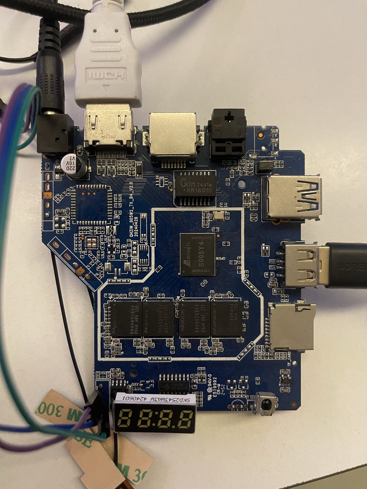

# KM7 / S905Y4 Ubuntu Bring-up and Recovery

This document preserves the verified findings from bringing up the original
Fenix Ubuntu image on the real KM7 board using the Amlogic S905Y4 (S4/AP222)
SoC. It is historical evidence; the current build commands and owner paths are
in [`../km7/README.md`](../km7/README.md).

It is intentionally board-specific. KM7 and Khadas VIM1S use the same SoC
family, but their board wiring, recovery keys, peripherals, and bootloader
behavior are not interchangeable.

Android full source code: /media/jimmy/WORK/AOSP/s905y4

## The board



Silkscreen: `QH21W_905W2_TX_B4_V20 20240428`. Note the `905W2` in the board
revision string — the fitted SoC is an **S905Y4**, which is what the DTS and
U-Boot target must match. Visible on the photo: HDMI, 100M Ethernet, AV/CVBS
jack, 2x USB-A, micro-USB (OTG/burning), TF card slot, 4 DDR packages (4 GB),
the SoC, and the **FD650 4-digit 7-segment front-panel module** on its ribbon.

## Serial console

The UART is the only reliable window into this board — use it for every
bring-up step below.

```bash
tio -b 921600 /dev/ttyUSB0
```

921600 baud, 8N1, no flow control. That matches `console=ttyS0,921600` in
`config/bootenv/KM7_uEnv.txt` and `earlycon=meson,0xfe07a000`
(`CONFIG_DEBUG_UART_BASE` in `km7_defconfig`). The console is `uart_B`
(`serial0` in km7.dts). If the adapter enumerates elsewhere, adjust the
device — `dmesg | tail` after plugging it in will name it.

`tio` reconnects automatically when the board resets, which is what you want
while power-cycling; `screen`/`minicom` will drop out instead.

## Current build configuration

The build configuration is:

```text
KHADAS_BOARD=KM7
LINUX=5.15
UBOOT=2019.01
DISTRIBUTION=Ubuntu
DISTRIB_RELEASE=noble
DISTRIB_TYPE=xfce
DISTRIB_ARCH=arm64
INSTALL_TYPE=SD-USB or EMMC
```

Load it and build with:

```bash
cd /media/jimmy/WORK/AOSP/fenix
source env/setenv.sh config km7-config.conf
make 2>&1 | tee km7_build.log
```

Do not confuse a boot failure with a build hang. A successful build ends with:

```text
Info: IMAGE: ... is ready!
Cleanup...
Done.
EXIT CODE: 0
```

The inspected `km7_build.log` completed successfully in 4 minutes 6 seconds.

## Boot chain

The relevant boot chain is:

```text
Amlogic BootROM
  -> signed BL2/BL2E/BL2X and DDR firmware
  -> BL31/secure firmware
  -> U-Boot 2019.01
  -> Linux Image + km7.dtb + initrd
  -> initramfs
  -> Ubuntu root filesystem
```

UART reaching:

```text
Starting kernel ...
Booting Linux on physical CPU ...
Run /init as init process
```

proves that the signed firmware, U-Boot, kernel image, DTB, and initrd handoff
have already succeeded. A failure after `Run /init` belongs to initramfs,
storage discovery, root filesystem selection, or userspace rather than the
early secure boot chain.

## Intentional initramfs breakpoint

The boot argument:

```text
break=premount
```

is not a normal production boot argument. Ubuntu `initramfs-tools` interprets
it as a request to stop and open a shell immediately before mounting the real
root filesystem.

For a normal boot, remove both `break=premount` and the very noisy
`initcall_debug` option:

```text
root=UUID=<actual-rootfs-uuid> rootdelay=10 rw rootfstype=ext4
console=ttyS0,921600 earlycon=meson,0xfe07a000
ignore_loglevel kvm-arm.mode=none
```

During initramfs debugging, press Enter after it stops and inspect:

```sh
cat /proc/cmdline
ls -l /dev/mmc*
blkid
dmesg | grep -Ei 'mmc|emmc|sd'
cat /proc/modules
```

## Verified eMMC/initramfs deadlock

The kernel config builds the Amlogic storage driver as a module:

```text
CONFIG_AMLOGIC_MMC_MESON_GX=m
CONFIG_AMLOGIC_MMC_CQHCI=m
```

The following facts were verified against the generated artifacts:

1. `km7.dtb` enables the eMMC controller at `mmc@fe08c000`.
2. The controller is compatible with `amlogic,meson-axg-mmc`.
3. `amlogic-mmc.ko` exists in the final root filesystem.
4. The generated `initrd.img-5.15.137` contains `cqhci.ko`.
5. The same initrd does **not** contain `amlogic-mmc.ko`.
6. The boot log consequently contains no Amlogic MMC probe and creates no
   `/dev/mmcblk*` device.

This creates a boot deadlock:

```text
initramfs needs amlogic-mmc.ko to detect eMMC
  -> amlogic-mmc.ko exists only inside the root filesystem
  -> root filesystem cannot be mounted until eMMC is detected
```

The KM7 filesystem overlay currently lacks the 5.15 initramfs module list
which the VIM1S profile supplies. The minimum known-good correction is:

```bash
mkdir -p archives/filesystem/special/KM7/etc/initramfs-tools
cp archives/filesystem/special/VIM1S/etc/initramfs-tools/modules.5.15 \
   archives/filesystem/special/KM7/etc/initramfs-tools/modules.5.15
```

Copying the complete early-module list is safer than adding only
`amlogic-mmc`: several Amlogic clock, reset, GPIO, pinctrl, power-domain, and
regulator providers are modules too. They may not be represented as direct
ELF dependencies even though the MMC controller needs them to probe from DT.

## The *runtime* module list was missing too

The fix above only covers `/etc/initramfs-tools/modules`. Separately,
`archives/filesystem/special/KM7/` had no `etc/modules.5.15`, which
`config/functions/build-board-deb`'s postinst renames to `/etc/modules`. KM7
images therefore shipped with **no `/etc/modules` at all**, so every driver
without a DT/PCI/USB modalias was never loaded:

- `dhd` — WiFi. Nothing brings up the SDIO WiFi device.
- `hci_uart`, `btbcm`, `btqca` — Bluetooth.
- every `amvdec_*` — all hardware video decode (H.264/H.265/VP9/AV1/…).
- `amlogic-snd-soc`, `amlogic-snd-codec-*` — the audio codecs behind
  `auge_sound`.
- `cfg80211`, `mac80211`, `leds-gpio`, `i2c-dev`, `amlogic-rtc`,
  `amlogic-led`, `v4l2-*`.

The old Fenix notes expected
`archives/filesystem/special/KM7/etc/modules.5.15` and
`etc/modprobe.d/dhd.conf.5.15`. Those archived paths are absent from the
current Fenix checkout, so they are not a reproducible input. This repository
owns the live module list and radio data through `config/boards/km7.csc` and
`packages/bsp/meson-s4t7/km7/` instead.

At this earlier Fenix stage the WiFi chip identity was still unconfirmed. The DT node is the generic
Amlogic `brcm,bcm4329-fmac` SDIO binding, while the vendor Android config
(`device/amlogic/KM7/wifibt.build.config.trunk.mk`) builds
`multiwifi` / `qca6174 ap6398s w1`. If `dhd` does not bind, check what
actually enumerates on `sd_emmc_a` before assuming a Broadcom part —
`w1` is Amlogic's own WiFi driver. The live ID and later port below resolved
that uncertainty.

## The VIM-COMMON rootfs overlay was never applied to KM7

`config/functions/build-board-deb` gated it on `[[ "$KHADAS_BOARD" =~
VIM[1234] ]]`, which KM7 does not match, so KM7 images shipped without:

- `usr/local/bin/fan.sh`, `fan_setup.sh` — the `fan=auto` bootarg is inert
  without them.
- `usr/local/bin/cpu_freq_setup.sh` — `CPUMIN` / `CPUMAX` / `GOVERNOR` from
  `config/boards/KM7.conf` were never applied.
- `etc/fw_env.config` — `fw_printenv` / `fw_setenv` cannot reach the U-Boot
  environment from Ubuntu without it, which matters directly for the
  recovery-key work above.
- `etc/udev/rules.d/99-amlogic.rules` — permissions for the `amvdec`,
  `ge2d`, `mali`, `ion` and heap device nodes.
- `etc/udev/rules.d/59-plug-event.rules`, `60-display.rules` plus
  `display_setup.sh` / `hdmi.sh` / `hdmitx_hpd_event.sh` — HDMI hotplug
  handling.
- `etc/rc.local`, `etc/mpv/mpv.conf`, `wol_setup.sh`, `systeminfo.sh`.

The XFCE/GNOME menu entries shipped from `archives/filesystem/blobs` point
at `fan_setup.sh` and `cpu_freq_setup.sh` unconditionally, so those desktop
entries were broken on KM7 as well. The gate now also matches `KM7`.

KM7 deliberately does **not** get VIM1S's own `etc/rc.local`: that one runs
`echo heartbeat > /sys/class/leds/pwmled/trigger` unguarded under `sh -e`,
and KM7 has no `pwmled`, so it would abort the rest of the script. The
VIM-COMMON copy guards every write with `[ -f ... ] &&`.

After rebuilding, extract or mount the produced filesystem and verify:

```bash
lsinitramfs /boot/initrd.img-5.15.137 |
  grep -E 'amlogic-mmc|cqhci'
```

Both drivers must be present before flashing.

## HDMI: `vout=none` / `hdmimode=none` and the DRM commit timeouts

### Symptom

The kernel cmdline contains:

```text
vout=none,enable panel_type=lcd_1 hdmitx=,444,8bit hdmimode=none
hdmichecksum=0x00000000
```

and the boot log then shows, in order:

```text
[hdmitx:] hdmitx_common_init_bootup_format_para hdmi is not enabled
[hdmitx:] system: plugout
[hdmitx:] ERROR hdmitx_validate_vmode validate none fail
vout: error: no matched vout_init mode none, force to invalid
[drm:meson_drm_crtc_commit_wait [aml_drm]] ERROR flip_done timed out
[drm:meson_commit_tail  [aml_drm]] ERROR [CRTC:63:VPP-0] commit wait timed out
[drm] [CRTC:63:VPP-0] vblank wait timed out
```

### Root cause

This is decided in U-Boot, not in Linux.

`CONFIG_PREBOOT` runs `init_display`, which runs `init_display_base`
(`include/amlogic/base_env.h`):

```text
hdmitx hpd; hdmitx get_parse_edid; hdmitx edid;
```

`hdmitx hpd` is `do_hpd_detect()` in `cmd/amlogic/cmd_vout.c`. It polls HPD
15 times at 100 ms and then calls `vout_hdmi_hpd(hpd_st)`, which on HPD low
does exactly this:

```c
if (!hpd_st) {
        env_set("outputmode", hdmimode);        /* hdmimode default is "none" */
        env_set("hdmichecksum", "0x00000000");
}
```

The other two commands then return early — `get_parse_edid` with
"HDMI HPD low, no need parse EDID", `edid` with "HDMI cable is NOT
connected" — so `select_best_resolution()` (`cmd/amlogic/edid-decode.c`,
which never returns "none"; its worst case is `1080p60hz`) is never reached.

`storeargs_base` then builds the cmdline from those env vars:

```text
vout=${outputmode},${vout_init} ... hdmimode=${hdmimode} hdmichecksum=${hdmichecksum}
```

which is the `vout=none` + `hdmimode=none` + `hdmichecksum=0x00000000`
triple seen above. The two env vars being set *together* is the fingerprint
of this code path — do not mistake it for a DTS mode-selection problem.

Linux cannot recover: `vout_serve` forces the output invalid, the VPP-0 CRTC
never gets a mode, and every DRM atomic commit ends in a flip_done timeout.

### What is *not* the cause

These appear on every S4 board including VIM1S (they come from
`meson-s4.dtsi`, not from km7.dts) and are vendor noise:

- `[hdmitx:] ERROR not get regbase index 11` — the DT lists 11 reg entries
  (index 0..10) and `hdmitx_init_reg_map()` loops to `REG_IDX_END`.
- `get cts_hdmi_axi_clk err` — that clock name is not in the S4 `clock-names`.
- `cvbsout: error: cvbsout_clktree_probe: clk venci_*_gate` — the S4 clock
  driver has no `venci` gates.
- `vout: error: aml_vout_get_dt_info: can't get vsync irq` — only used for
  `vs_meas`.

The DRM HDMI connector coming from `&amhdmitx` (which carries the `ports`
endpoint) rather than from the near-empty `drm-amhdmitx` stub is also normal
for 5.15 — `kvim1s.dtb` has the identical stub.

### Fix

`build/u-boot/board/khadas/configs/km7.h` overrides `init_display` to clamp
the failure case, tracked as
`archives/sources/KM7/u-boot/0002-*.patch`:

```text
init_display=run init_display_base;
  if test ${outputmode} = none; then
    echo hdmi: no EDID/HPD, forcing 1080p60hz;
    setenv hdmimode 1080p60hz;
    setenv outputmode 1080p60hz;
    setenv colorattribute 444,8bit;
    vout output ${outputmode};
  fi;
```

A valid EDID still wins; this branch only runs when auto-detection gave up.

Note for anyone editing that file: the env lives inside a backslash-continued
macro. Line splicing happens before comment removal, so a comment line
without a trailing backslash silently truncates the environment. Keep
comments outside `CONFIG_EXTRA_ENV_SETTINGS`.

### Confirming it on hardware

The fix makes the board output *something* even with a dead HPD, but it does
not explain *why* HPD reads low. Capture the U-Boot log and look for:

```text
do_hpd_detect, hpd_state=0
```

- `hpd_state=1` with a real `bestmode is ...` line → HPD/DDC are fine and the
  original failure was transient (TV off/late, or no cable at that boot).
- `hpd_state=0` with a TV connected and powered → a genuine board-level HPD
  or HDMI-5V problem. km7.dts is not at fault: `hdmitx-gpios-hpd`
  (`GPIOH_2`), `-scl` (`GPIOH_1`), `-sda` (`GPIOH_0`) and the
  `hdmitx_hpd`/`hdmitx_ddc` pinmux groups are byte-identical to the vendor
  Android blob, and nothing else in km7.dts claims `GPIOH_0..2`.

Once up, cross-check from Ubuntu:

```bash
cat /sys/class/amhdmitx/amhdmitx0/hpd_state    # 1 = sink detected
cat /sys/class/amhdmitx/amhdmitx0/disp_cap     # modes read from EDID
cat /sys/class/display/mode
```

### Quick test without reflashing the bootloader

`config/bootenv/KM7_uEnv.txt` carries a commented-out `boot_user_args` line
that appends `vout=1080p60hz,enable hdmimode=1080p60hz`. Because extlinux
appends `${boot_user_args}` last, it overrides U-Boot's values. Use it to
confirm the diagnosis; the U-Boot change above is the durable fix, and
forcing a mode there caps a 4K TV at whatever mode you pick.

## Two pinmux conflicts that killed WiFi, Bluetooth and the front panel

Both were KM7-only regressions, both live-verified, both fixed in km7.dts.

### GPIOX_16 — `&pwm_ef` vs the WiFi 32 kHz clock

km7.dts gave `&pwm_ef` a `pinctrl-0 = <&pwm_e_pins1>` that kvim1s.dts
deliberately omits. That group is `pwm_e_x` = GPIOX_16, which carries the
32.768 kHz reference the SDIO WiFi part needs to leave reset, and
`meson-s4.dtsi` already points `&aml_wifi`'s pinctrl at the same group.
First claim wins, and `pwm_ef` probed first:

```text
pin GPIOX_16 already requested by fe05c000.pwm; cannot claim for aml_wifi
pin-64 (aml_wifi) status -22
aml_wifi aml_wifi: Error applying setting, reverse things back
```

so the part never clocked and the bus was empty:

```text
[mmc]: sdio vendor is 0x0
meson-gx-mmc fe088000.sdio: 5 [0x0], TIMEOUT[0x2800]     (CMD5/CMD55/CMD1)
```

Dropping the `pinctrl-0` (the controller stays `okay`, so `wifi_pwm_conf`
still gets its channel through the PWM API) takes it to a fully enumerated
device: 7 SDIO functions, all `vendor=0x8888 device=0x8888`.

### GPIOD_6/GPIOD_7 — `&i2c1` vs the FD650 front panel

`i2c1_pins2` is `i2c1_sda_d`/`i2c1_scl_d`, the front-panel header pins:

```text
pin GPIOD_6 already requested by fe068000.i2c; cannot claim for periphs-banks:460
fd650 fd650: Can't get fd650 gpios! Error: -22
```

Nothing is populated on that bus. `tlc59116@0x60` is `disabled` in the
vendor Android KM7.dtb, and its Linux driver binds without ever reading the
chip — so the `/sys/class/leds/i2c_leds` node it creates is not evidence the
part exists. `aw9523b@0x5b` is absent from the vendor blob entirely and
reports `aw9523_i2c_probe: there is no aw9523 ret=-22` on real hardware.

The vendor gets away with enabling i2c1 on these pins because its 5.4 fd628
driver bit-bangs GPIOs by name and bypasses pinctrl ownership; the 5.15
fd650 driver uses `of_get_named_gpio()` + `devm_gpio_request()` and is
refused. Disabling i2c1 and both LED devices lets `fd650` probe.

## WiFi needed the Amlogic W1 driver ported

Current status: the port completed in the Fenix kernel worktree and is now
tracked by this repository as
`patch/kernel/archive/meson-s4t7-5.15-km7/0007-*.patch`, with RF tables under
`packages/bsp/meson-s4t7/km7/vendor/etc/wifi/w1/`. The failure analysis below
explains why that port was required; the new Armbian image still needs a live
association test before support is marked verified.

The pinmux fix above gets the hardware working — the chip powers up and
enumerates. What is missing is a driver.

The part is an **Amlogic W1**, not Broadcom. All 7 SDIO functions report
`0x8888:0x8888`, which is `VENDOR_AMLOGIC`/`PRODUCT_AMLOGIC` in
`vendor/wifi_driver/amlogic/w1/wifi/project_w1/common/fi_sdio.h`. `dhd`
loads, powers the adapter, finds no Broadcom part and exits:

```text
[dhd] failed to power up DHD generic adapter, max retry reached
[dhd] _dhd_module_init: Exit err=-19
```

Source: `/media/jimmy/WORK/AOSP/s905y4/vendor/wifi_driver/amlogic/w1/`
(the `vendor/amlogic/common/wifi_bt/wifi/w1` path is only RF calibration
data — `aml_wifi_rf*.txt` — which the driver also needs at runtime). It
builds `aml_sdio.ko` and `vlsicomm.ko`, and carries
`KERNEL_VERSION(5, 15, 0)` guards, so it is not hopeless.

An out-of-tree build against this kernel gets through configure and then
fails in 15 files. The work is real but bounded:

- `set_fs()`/`get_fs()`/`KERNEL_DS` — removed for arm64 in 5.10. 18 hits.
- cfg80211 op signatures — this kernel has the `link_id` parameters
  backported, so `add_key`, `set_bitrate_mask`, `stop_ap`, `set_ap_chanwidth`
  and `del_station` all need extra args.
- The driver ships its **own copy** of mac80211's rate control
  (`rc80211_minstrel*.c`), which no longer matches: `add_sta_debugfs`,
  `remove_sta_debugfs` and `dbg_fixed_rate` are gone. Easiest fix is to drop
  those files and use the kernel's minstrel.
- `linux/wlan_plat.h` missing, a `crc` macro arity error (13 hits), and
  `wireless_dev->preset_chandef` gone.
- The Makefile sets `-Werror`; turning it off first makes the real errors
  much easier to see.

Bluetooth rides the same W1 combo. The historical Fenix image presented only
a soft-blocked rfkill entry with no HCI device. The current Armbian build no
longer runs Broadcom `hciattach`, but Bluetooth HCI is still unverified on the
real board and must remain an explicit acceptance item.

Never reuse a UUID copied from an older image. The UART test used:

```text
bc2186ad-255b-41b7-8529-bbf9182c0a13
```

while a later generated `rootfs.img` was verified as:

```text
417c84b4-9b53-46a4-87be-d72ab78f5130
```

These can both be correct for different artifacts. Verify the exact image that
will be flashed:

```bash
blkid build/images/rootfs.img
tune2fs -l build/images/rootfs.img | grep 'Filesystem UUID'
```

The `root=UUID=` argument needs the ext4 filesystem UUID, not the disk
identifier or partition-table PARTUUID.

## Why the physical flash/recovery key stopped working

An EMMC Amlogic upgrade image does more than write the Ubuntu filesystem. Its
package configuration includes:

```text
file="u-boot.bin.signed" main_type="PARTITION" sub_type="bootloader"
```

Therefore flashing the Fenix EMMC image replaces the working Android
bootloader and its recovery-key implementation.

The stock S4/AP222 bootloader implements the real recovery key using SARADC:

```text
saradc open 0
saradc get_in_range 0 50
run update
```

and executes `run adc_update_key` from `CONFIG_PREBOOT`.

The current Fenix KM7 U-Boot instead contains:

```text
upgrade_key=if gpio input GPIOD_8; then ... run update; fi;
```

and runs that GPIO implementation from `CONFIG_PREBOOT`. That mapping came
from the Khadas-oriented KM7/VIM1S profile and does not reproduce the stock
AP222 recovery-button path. Consequently, the same physical button sequence
that entered USB Burning mode under Android no longer works after flashing
the Fenix bootloader.

This is not proof that USB Burning support was removed. The compiled U-Boot
still contains:

```text
CONFIG_AML_V3_FACTORY_BURN=y
CONFIG_AML_V3_USB_TOOl=y
CONFIG_USB_GADGET=y
CONFIG_USB_GADGET_DOWNLOAD=y
usb_burning=adnl 1200
update=run update_base
```

## Recover USB Burning mode through UART

As long as UART reaches the `km7#` prompt, do not short or erase eMMC.

1. Connect the UART adapter and the USB burning cable.
2. Power on the KM7.
3. Press Space repeatedly to stop autoboot.
4. Confirm the burning environment:

   ```text
   km7# printenv usb_burning update
   ```

5. Enter Amlogic USB DNL mode directly:

   ```text
   km7# run usb_burning
   ```

   Equivalent direct command:

   ```text
   km7# adnl 1200
   ```

6. If necessary, use the full update fallback chain:

   ```text
   km7# run update
   ```

7. On the host, confirm enumeration:

   ```bash
   lsusb | grep -i Amlogic
   ```

   A common expected ID is:

   ```text
   1b8e:c004 Amlogic, Inc. DNL
   ```

8. Load the corrected upgrade image in Amlogic Burn Tool/USB Burning Tool and
   flash it normally.

## Last-resort recovery

If the board can no longer reach U-Boot:

1. Prefer a documented KM7/AP222 MaskROM or eMMC-disable test point.
2. Force the SoC to fail eMMC boot so BootROM falls back to USB download mode.
3. Confirm an Amlogic USB device before starting the burning tool.

Do not randomly short eMMC pins. The exact CLK/data/test-point location must
be established from the KM7 schematic or high-resolution PCB tracing first.
Shorting the wrong pin can damage the SoC, eMMC, or power rail.

Erasing the bootloader from U-Boot is another recovery method:

```text
store boot_erase bootloader
reboot
```

This is destructive. Use it only when `run usb_burning` fails and the host is
ready to flash immediately after the board returns in BootROM download mode.

## Permanent bootloader fix

Before distributing another EMMC image:

1. Port `adc_update_key` from the stock AP222 U-Boot configuration.
2. Execute it from the KM7 `CONFIG_PREBOOT`.
3. Keep UART `run usb_burning` available.
4. Verify USB gadget and Amlogic DNL support remain enabled.
5. Verify the physical recovery key before flashing more than one test board.
6. Confirm both normal boot and recovery mode after at least five cold boots.

The source references used for this comparison are:

```text
/media/jimmy/WORK/AOSP/s905y4/bootloader/uboot-repo/bl33/v2019/
  board/amlogic/configs/s4_ap222.h

/media/jimmy/WORK/AOSP/fenix/build/u-boot/
  board/khadas/configs/km7.h

/media/jimmy/WORK/AOSP/fenix/build/images_upgrade-*/
  Amlogic/package_s4.conf
```

`build/u-boot` and `build/images_upgrade-*` are generated/downloaded working
trees. A durable fix must be carried through a tracked Fenix patch or source
override rather than editing only the generated build directory.

## Where the KM7 board sources actually live

`/build` is gitignored by Fenix, and `build/u-boot` and
`build/linux/common_drivers` are clones Fenix manages itself. Everything that
makes KM7 a board — `km7_defconfig`, `board/khadas/km7/`, `km7.h`, `km7.dts`,
the `dtb-y += km7.dtb` Makefile line — therefore sat *outside* this
repository's version control, where a clean checkout, a branch switch or
`make ARCH=arm64 distclean` destroys it. `km7.dts` was not even committed in
its own tree; it was an untracked file.

That work is now tracked as git patch series under `archives/sources/KM7/`:

```text
archives/sources/KM7/u-boot/0001-Add-KM7-...-board-support.patch
archives/sources/KM7/u-boot/0002-km7-fall-back-to-1080p60hz-...patch
archives/sources/KM7/linux-common-drivers/0001-arm64-dts-...-add-km7.dtb...patch
archives/sources/KM7/linux-common-drivers/0002-arm64-dts-...-disable-...-DVB...patch
```

After a fresh clone, and before every build:

```bash
./scripts/km7-apply-board-sources.sh
```

It is idempotent (it compares `git patch-id` against recent history) and
fails loudly with the `git am -3` command to run by hand if the upstream
Khadas branch has moved under a patch.

If you change anything in those trees, re-export before committing:

```bash
cd build/u-boot && git format-patch -o ../../archives/sources/KM7/u-boot 355c200a9b~1..HEAD
cd build/linux/common_drivers && git format-patch -o ../../../archives/sources/KM7/linux-common-drivers 3a11a86a0..HEAD
```

## Pre-flash acceptance checklist

Before flashing any future KM7 EMMC image:

- Build exits with code zero.
- Image filename includes a unique date and time.
- The image checksum is recorded.
- The selected DTB is `km7.dtb`, not a VIM1S DTB.
- The root filesystem UUID matches the generated boot arguments.
- `amlogic-mmc.ko` and `cqhci.ko` are present in initrd.
- The root filesystem passes `e2fsck -fn`.
- The upgrade package contains the intended signed bootloader.
- The packaged `/boot/boot.scr` qualifies every eMMC filesystem read with
  `${devnum}:${distro_bootpart}`.
- The built U-Boot config contains `CONFIG_CMD_SETEXPR=y`.
- UART reaches U-Boot and `printenv usb_burning update` is valid.
- `run usb_burning` enumerates on the host.
- The physical AP222 recovery key enters USB Burning mode.
- A known-good Android factory image remains available for recovery.
